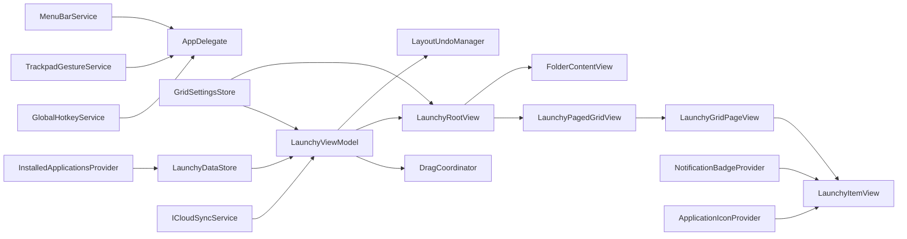

# Launchy

Launchy is a macOS SwiftUI application that recreates the familiar Launchpad experience with enhanced customization. It lets you browse, search, and organize installed apps into pages and folders with smooth paging, wiggle mode editing, and persistent layout storage.

## Features

- **App Browsing** – grid of installed apps with search, paging, and keyboard navigation.
- **Wiggle Mode** – reorder apps, create folders, and batch-move selections with multi-select tools.
- **Folders** – drag-and-drop or tap to organize multiple apps into named collections.
- **App Launching** – click any app tile to open it immediately and close the launcher.
- **Settings** – tweak grid dimensions, icon scaling, and other layout preferences.
- **Persistence** – local storage keeps your custom layout intact between sessions.

## Keyboard Shortcuts

| Shortcut | Action |
|----------|--------|
| `⌘E` | Toggle wiggle (edit) mode |
| `⌘,` | Open settings |
| `←` / `→` | Navigate between pages |
| `Home` / `End` | Jump to first / last page |
| `Page Up` / `Page Down` | Navigate between pages |
| `Escape` | Layered dismiss: close folder → close settings → clear search → exit edit mode → hide launcher |
| Trackpad swipe / scroll | Navigate between pages (sensitivity configurable in settings) |
| `F4` | Global hotkey to toggle launcher visibility |

## Architecture



| Layer | Responsibility |
|-------|---------------|
| **Models** | `AppIcon`, `LaunchyItem`, `LaunchyFolder`, `GridSettings` — pure value types (`Codable`, `Sendable`) |
| **Services** | `InstalledApplicationsProvider` discovers apps; `LaunchyDataStore` persists layout; `GridSettingsStore` persists preferences; `GlobalHotkeyService` / `TrackpadGestureService` handle activation; `MenuBarService` provides status item; `NotificationBadgeProvider` polls app badges; `ApplicationIconProvider` caches icons; `ICloudSyncService` syncs layout; `LayoutUndoManager` manages undo/redo |
| **ViewModels** | `LaunchyViewModel` owns the item list, paging, editing, and folder logic; `DragCoordinator` encapsulates drag-and-drop state and stacking |
| **Views** | SwiftUI views for the grid, folder overlay, settings panel, and search field |

## Requirements

- macOS 14.0 or newer
- Xcode 16+ with the Swift 6.2 toolchain (required for the Swift 6.2 package manifest)

## Getting Started

Clone the repository and build:

```bash
git clone https://github.com/your-username/launchy.git
cd launchy

# Build and run in debug mode
make run

# Or build a release .app bundle
make bundle

# Create an unsigned DMG for distribution
make dmg
```

## Development Tips

- Use `swift build` before submitting changes to ensure everything still compiles.
- Run `make test` to verify the test suite passes.
- Use `make dmg` to produce an unsigned DMG for local testing.
- Launch the app and press the edit button (wiggle mode) to manage icons and folders.
- Dependabot is configured for Swift and GitHub Actions updates; expect PRs prefixed with `chore(deps)`.

## Contributing

1. Fork the repo and create a feature branch.
2. Follow the pull request template (`.github/pull_request_template.md`).
3. Include relevant issue links and screenshots for UI changes.
4. Ensure new functionality has appropriate tests or manual verification steps.

## License

This project is licensed under the GPLv3 License. See `LICENSE.txt` for details.
